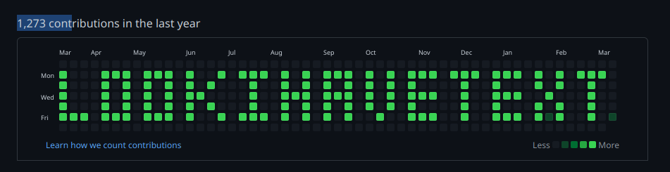

# GitHub art

A few scripts to draw art to you commit graph on github.



# Running:

The art to draw is defined in ``gendates.py``, you likley want to edit it.

Then clone an empty repo to ``repo``:

```
git clone git@github.com:you/somename.git repo
```
Next run ``doit.sh`` to generate the commits.

Finaly ``cd`` into repo and ``git push``. enjoy!

## Tips:

If you have a large ammount of contributions, you may want to use an alt account. (Make sure to set ``GIT_COMMITTER_EMAIL`` and edit commits.sh to pass ``--author`` to git.)
